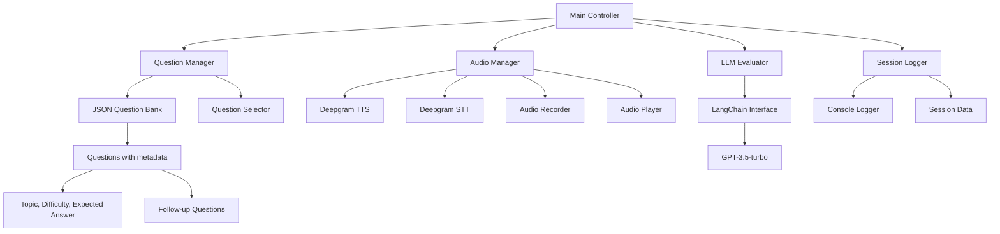
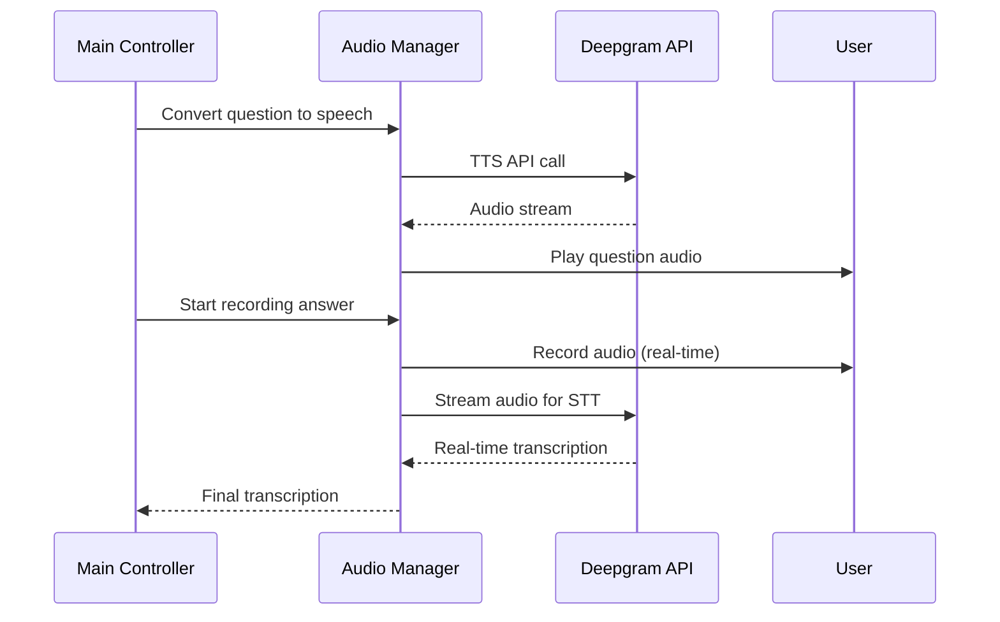
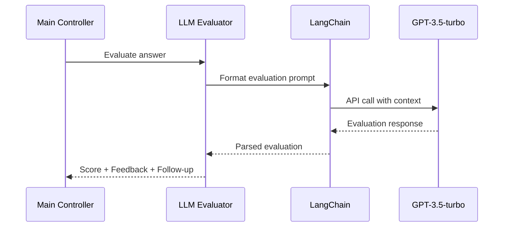

# AI Voice Interviewer System - Architecture Plan

## System Overview
The system will be a modular Python application that conducts voice-based interviews using:
- **Deepgram** for both TTS (Text-to-Speech) and STT (Speech-to-Text)
- **LangChain** with GPT-3.5-turbo for answer evaluation
- **Real-time audio streaming** for optimal speed
- **JSON-based question bank** for flexible content management
- **Modular design** for easy UI integration later

## System Architecture



## Core Components

### 1. **Main Controller** (`main.py`)
- Orchestrates the entire interview flow
- Handles user input for difficulty and topics
- Manages the interview session lifecycle
- Coordinates between all modules

### 2. **Question Manager** (`question_manager.py`)
- Loads and parses JSON question bank
- Filters questions by topic and difficulty
- Selects appropriate questions for the session
- Manages follow-up question logic

### 3. **Audio Manager** (`audio_manager.py`)
- **TTS Module**: Converts text to speech using Deepgram
- **STT Module**: Real-time speech transcription using Deepgram streaming
- **Audio Recorder**: Captures user responses with silence detection
- **Audio Player**: Plays generated speech

### 4. **LLM Evaluator** (`llm_evaluator.py`)
- LangChain integration with GPT-3.5-turbo
- Evaluates user answers against expected responses
- Provides 1-10 scoring with detailed feedback
- Generates follow-up questions when needed

### 5. **Session Logger** (`session_logger.py`)
- Logs all interactions to console
- Tracks scores and feedback
- Maintains session history
- Exportable session data

### 6. **Configuration Manager** (`config.py`)
- Environment variable management
- API key handling
- System settings and parameters

## Data Structures

### Question Bank JSON Schema
```json
{
  "questions": [
    {
      "id": "q001",
      "text": "Explain the concept of object-oriented programming",
      "topic": "programming",
      "difficulty": 3,
      "expected_answer": "OOP is a programming paradigm based on objects...",
      "follow_up_questions": [
        "Can you give an example of inheritance?",
        "What are the benefits of encapsulation?"
      ]
    }
  ]
}
```

### Session Data Structure
```python
{
  "session_id": "uuid",
  "timestamp": "datetime",
  "user_preferences": {
    "topics": ["programming", "algorithms"],
    "difficulty": 3
  },
  "questions_asked": [
    {
      "question_id": "q001",
      "question_text": "...",
      "user_answer": "...",
      "transcription_confidence": 0.95,
      "llm_score": 7,
      "llm_feedback": "...",
      "follow_up": "..."
    }
  ]
}
```

## Technical Implementation Details

### Audio Processing Flow


### LLM Evaluation Flow


## File Structure
```
ai_voice_interviewer/
├── main.py                 # Main application entry point
├── config.py              # Configuration and environment setup
├── requirements.txt       # Python dependencies
├── .env                   # Environment variables
├── README.md             # Setup and usage instructions
├── 
├── src/
│   ├── __init__.py
│   ├── question_manager.py    # Question bank management
│   ├── audio_manager.py       # Audio processing (TTS/STT)
│   ├── llm_evaluator.py       # LangChain LLM integration
│   └── session_logger.py      # Logging and session management
├── 
├── data/
│   └── question_bank.json     # Sample question database
├── 
├── tests/
│   ├── __init__.py
│   ├── test_question_manager.py
│   ├── test_audio_manager.py
│   └── test_llm_evaluator.py
└── 
└── logs/
    └── sessions/              # Session log files
```

## Key Features

1. **Real-time Audio Processing**: Streaming audio to Deepgram for fastest response times
2. **Modular Architecture**: Easy to extend and modify individual components
3. **Flexible Question Bank**: JSON-based with rich metadata support
4. **Smart Question Selection**: Topic and difficulty-based filtering
5. **Comprehensive Logging**: Detailed session tracking and console output
6. **Error Handling**: Robust error handling for API failures and audio issues
7. **Environment Configuration**: Secure API key management
8. **Future-Ready**: Designed for easy UI integration

## Dependencies
- `deepgram-sdk`: Deepgram API integration
- `langchain`: LLM abstraction layer
- `openai`: GPT API access
- `pyaudio`: Audio recording and playback
- `python-dotenv`: Environment variable management
- `pydantic`: Data validation
- `asyncio`: Asynchronous operations
- `json`: Question bank parsing
- `logging`: Session logging

## Usage Flow
1. **Initialization**: Load question bank, configure APIs
2. **Setup**: User specifies topics and difficulty level
3. **Interview Loop**:
   - Select relevant question
   - Convert to speech and play
   - Record user response
   - Transcribe speech to text
   - Evaluate answer with LLM
   - Log results and provide feedback
   - Handle follow-up questions if generated
4. **Session End**: Display summary and save session data

## Implementation Notes

### API Configuration
- Deepgram API Key: Use environment variable `DEEPGRAM_API_KEY`
- OpenAI API Key: Use environment variable `OPENAI_API_KEY`
- All sensitive data should be stored in `.env` file

### Audio Settings
- Sample Rate: 16kHz for optimal Deepgram performance
- Format: WAV for recording, streaming for real-time processing
- Silence Detection: 2-second silence threshold to end recording

### LLM Evaluation Prompt Template
```
Evaluate the following interview answer:

Question: {question}
Expected Answer: {expected_answer}
User Answer: {user_answer}

Please provide:
1. A score from 1-10 (10 being perfect)
2. Detailed feedback on accuracy and completeness
3. Specific improvement suggestions
4. Optional follow-up question if the answer needs clarification

Format your response as JSON with keys: score, feedback, suggestions, follow_up
```

### Error Handling Strategy
- API failures: Graceful degradation with retry logic
- Audio issues: Clear user instructions and fallback options
- Network problems: Offline mode with local processing where possible
- Invalid responses: Input validation and user-friendly error messages

This architecture provides a solid foundation that's both functional for immediate use and extensible for future enhancements like web UI integration, advanced analytics, or additional LLM providers.