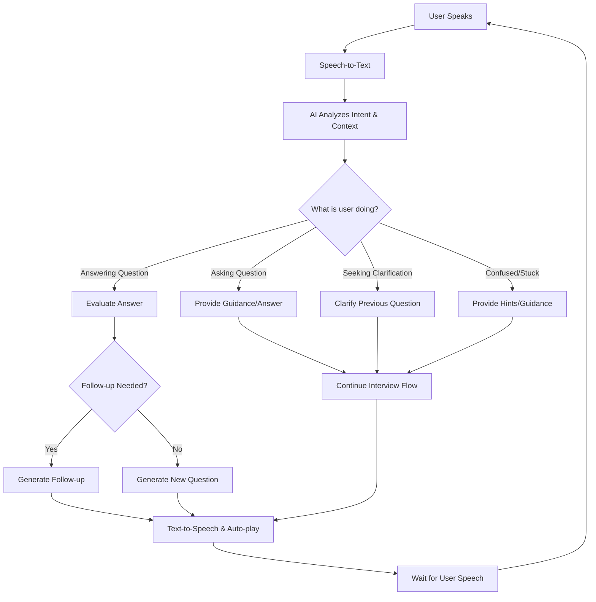

# Conversational AI Interview System - Complete Plan

## Core Concept
**Fully conversational interview** where the AI acts as a human interviewer, understanding context, deciding flow, and maintaining natural dialogue without any button clicks.

## System Architecture

### 1. Conversational Flow Intelligence



### 2. AI Intent Recognition System

**The AI must understand:**
- Is user answering the current question?
- Is user asking a clarification question?
- Is user asking for help/guidance?
- Is user confused or stuck?
- Is user ready for next question?

### 3. Conversation State Management

```python
class ConversationState:
    def __init__(self):
        self.current_question = None
        self.awaiting_answer = True
        self.follow_up_count = 0
        self.max_follow_ups = 3
        self.conversation_history = []
        self.user_confusion_signals = []
        self.topics_covered = {}
        self.interview_context = {}
```

## Implementation Strategy

### 1. AI Conversation Manager

```python
class AIConversationManager:
    def process_user_speech(self, transcript, context):
        """
        Analyze user speech and determine appropriate response
        """
        intent = self.analyze_intent(transcript, context)
        
        if intent == "answering_question":
            return self.handle_answer(transcript, context)
        elif intent == "asking_question":
            return self.handle_user_question(transcript, context)
        elif intent == "seeking_clarification":
            return self.handle_clarification_request(transcript, context)
        elif intent == "confused_or_stuck":
            return self.handle_confusion(transcript, context)
    
    def analyze_intent(self, transcript, context):
        """
        Use AI to determine what the user is trying to do
        """
        prompt = f"""
        Analyze this user speech in interview context:
        
        Current Question: {context.current_question}
        User Speech: {transcript}
        Awaiting Answer: {context.awaiting_answer}
        
        Determine intent:
        - "answering_question": User is providing answer to current question
        - "asking_question": User is asking interviewer a question
        - "seeking_clarification": User wants current question clarified
        - "confused_or_stuck": User is confused or needs help
        
        Return just the intent.
        """
        return self.llm.generate(prompt)
```

### 2. Follow-up Decision Logic

```python
def should_follow_up(self, answer_evaluation, context):
    """
    Intelligent decision on whether to follow up or move on
    """
    factors = {
        'answer_quality': answer_evaluation.score,
        'answer_completeness': self.assess_completeness(answer_evaluation),
        'follow_up_count': context.follow_up_count,
        'time_remaining': context.get_remaining_time(),
        'user_engagement': self.assess_engagement(context),
        'topic_depth': context.get_topic_coverage_depth()
    }
    
    # AI-powered decision
    prompt = f"""
    Decide whether to ask follow-up or move to new question:
    
    Answer Quality: {factors['answer_quality']}/10
    Answer Completeness: {factors['answer_completeness']}
    Follow-ups Asked: {factors['follow_up_count']}/3
    Time Remaining: {factors['time_remaining']} minutes
    
    Guidelines:
    - Follow up if answer is incomplete but shows understanding
    - Follow up if answer reveals interesting depth to explore
    - Move on if answer is complete or user seems stuck
    - Move on if already asked 2-3 follow-ups
    - Consider time remaining
    
    Return: "follow_up" or "new_question" with brief reason
    """
    
    decision = self.llm.generate(prompt)
    return decision
```

### 3. User Question Handling

```python
def handle_user_question(self, user_question, context):
    """
    Handle when candidate asks interviewer a question
    """
    prompt = f"""
    You are an experienced technical interviewer. The candidate asked:
    "{user_question}"
    
    Interview Context:
    - Current Question: {context.current_question}
    - Topics: {context.topics}
    - Interview Progress: {context.get_progress()}
    
    Provide a helpful, professional response that:
    - Answers their question appropriately
    - Maintains interview flow
    - Encourages them to continue
    - Doesn't give away answers
    
    Then smoothly transition back to interview.
    """
    
    response = self.llm.generate(prompt)
    return {
        'type': 'guidance',
        'text': response,
        'auto_play': True
    }
```

### 4. Natural Conversation Prompts

#### Intent Analysis Prompt
```
System: You are analyzing speech in a technical interview context.

Current State:
- Question Asked: "{current_question}"
- Awaiting Answer: {awaiting_answer}
- Follow-ups So Far: {follow_up_count}

User Said: "{transcript}"

Analyze what the user is doing:
1. "answering" - Providing answer to current question
2. "asking" - Asking interviewer a question  
3. "clarifying" - Wants current question explained
4. "confused" - Stuck or needs help

Return only the category.
```

#### Follow-up Decision Prompt
```
System: You are deciding interview flow as an expert interviewer.

Answer Evaluation:
- Score: {score}/10
- Feedback: {feedback}
- Completeness: {completeness}

Context:
- Follow-ups asked: {follow_up_count}
- Time remaining: {time_remaining} minutes
- Topic depth: {topic_coverage}

Should you:
A) Ask follow-up question (if answer needs exploration)
B) Move to new question (if answer is complete/time to move on)

Consider:
- Quality and depth of answer
- Time constraints
- Natural conversation flow
- Avoiding over-questioning

Return: "follow_up" or "new_question"
```

#### Response Generation Prompt
```
System: You are a professional technical interviewer having a natural conversation.

Context:
- Interview Duration: {duration} minutes
- Time Remaining: {time_remaining} minutes  
- Topics: {topics}
- Conversation History: {recent_history}

User just said: "{user_speech}"
Intent: {intent}

Generate natural response that:
- Maintains professional but friendly tone
- Flows naturally in conversation
- Advances interview appropriately
- Provides value to candidate

Response should be spoken aloud (will be converted to speech).
```

## UI/UX Changes Required

### 1. Remove All Interview Control Buttons
- ❌ "Next Question" button
- ❌ "Play Question" button  
- ❌ "Record Answer" button
- ❌ "Stop Recording" button

### 2. Single Interaction Model
- ✅ **One button only**: "Push to Talk" (or voice activation)
- ✅ **Auto-play**: All AI responses play automatically
- ✅ **Visual indicators**: Show when AI is thinking/speaking
- ✅ **Conversation history**: Display ongoing dialogue

### 3. New UI Layout
```
┌─────────────────────────────────────┐
│  🎤 AI Voice Interviewer            │
├─────────────────────────────────────┤
│  ⏱️ Time: 23:45 remaining           │
├─────────────────────────────────────┤
│  💬 Conversation                    │
│                                     │
│  🤖 AI: "Let's start with..."       │
│  👤 You: "I think that..."          │
│  🤖 AI: "Interesting, can you..."   │
│  👤 You: "Actually, I have a..."    │
│  🤖 AI: "Great question! The..."    │
│                                     │
├─────────────────────────────────────┤
│  [🎤 Hold to Speak]                 │
│  Status: Listening... / AI Thinking │
└─────────────────────────────────────┘
```

## Technical Implementation

### 1. Conversation Engine
```python
class ConversationEngine:
    def __init__(self):
        self.ai_manager = AIConversationManager()
        self.speech_processor = SpeechProcessor()
        self.context = ConversationState()
    
    async def process_user_speech(self, audio_data):
        # 1. Speech to text
        transcript = await self.speech_processor.transcribe(audio_data)
        
        # 2. Analyze intent and generate response
        response = self.ai_manager.process_user_speech(transcript, self.context)
        
        # 3. Update conversation state
        self.context.add_exchange(transcript, response)
        
        # 4. Convert to speech and return
        audio_response = await self.speech_processor.text_to_speech(response['text'])
        
        return {
            'transcript': transcript,
            'response_text': response['text'],
            'response_audio': audio_response,
            'auto_play': True
        }
```

### 2. WebSocket Message Flow
```python
# User speaks
{
    'type': 'user_speech',
    'audio_data': 'base64...',
    'session_id': 'xxx'
}

# AI responds
{
    'type': 'ai_response',
    'transcript': 'user said this',
    'response_text': 'AI response text',
    'response_audio': 'base64 audio',
    'conversation_state': 'updated state',
    'auto_play': True
}
```

## Benefits of Conversational Approach

### 1. Natural Interview Experience
- Feels like talking to human interviewer
- No artificial button-clicking interruptions
- Natural conversation flow and pacing

### 2. Intelligent Adaptation
- AI decides when to follow up vs. move on
- Handles candidate questions naturally
- Provides guidance when needed

### 3. Better Assessment
- More authentic responses in natural conversation
- Can assess communication skills better
- Reveals thinking process through dialogue

### 4. Enhanced User Experience
- Less cognitive load (no UI decisions)
- More engaging and immersive
- Reduces interview anxiety

## Implementation Steps

1. **Conversation Engine Core** - Intent analysis and response generation
2. **UI Simplification** - Remove buttons, add conversation view
3. **Auto-play Integration** - Seamless audio playback
4. **Context Management** - Track conversation state
5. **Testing & Refinement** - Ensure natural flow

This creates a truly intelligent, conversational interview experience that feels natural and professional.